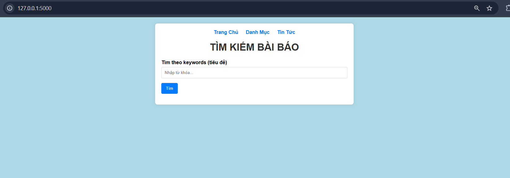
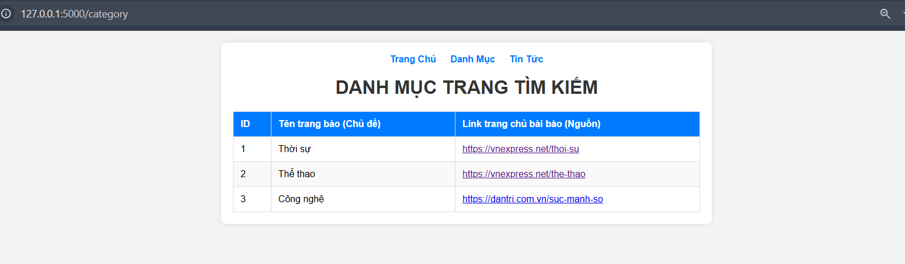
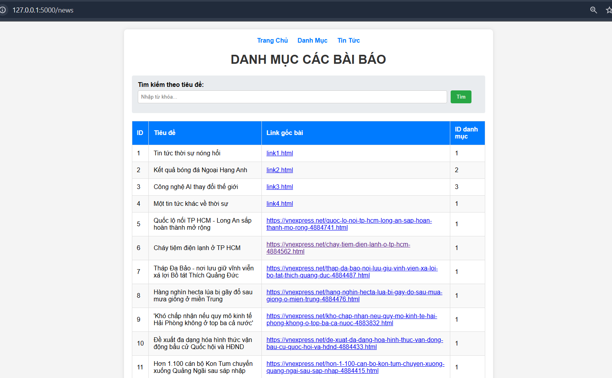

# CrawNews
## Bài Lab5 Thầy Nguyễn Thể Bảo 12/05/2025
## Hướng dẫn chạy project

### 1. Yêu cầu hệ thống

-Có thể dùng powershell hoặc bash của linux

- Python 3.8 trở lên
- PostgreSQL đã cài đặt và tạo database (ví dụ: crawNews)

### 2. Cài đặt môi trường

```powershell
python -m venv venv
venv\Scripts\activate
pip install -r requirements.txt
```

### 3. Cấu hình kết nối database

- Tạo file `.env` trong thư mục gốc với nội dung:

```
DATABASE_URL=postgresql://<username>:<password>@localhost:5432/crawNews
```

Thay `<username>` và `<password>` bằng thông tin PostgreSQL của bạn.

### 4. Khởi tạo database

```powershell
flask db upgrade
```

### 5. Thêm dữ liệu mẫu (tùy chọn)

```powershell
flask seed-db
```

### 6. Crawl tin tức thực tế từ VnExpress

```powershell
flask crawl-news
```

### 7. Chạy ứng dụng web

```powershell
python app.py
```

Sau đó truy cập: http://127.0.0.1:5000/

---

### Trang chủ



### Danh mục



### Tin tức


